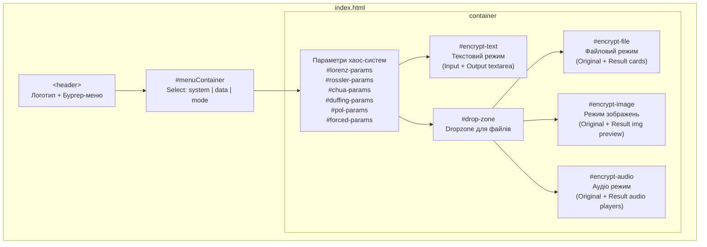
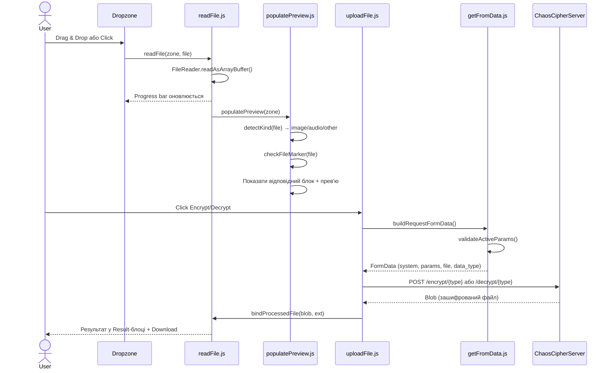
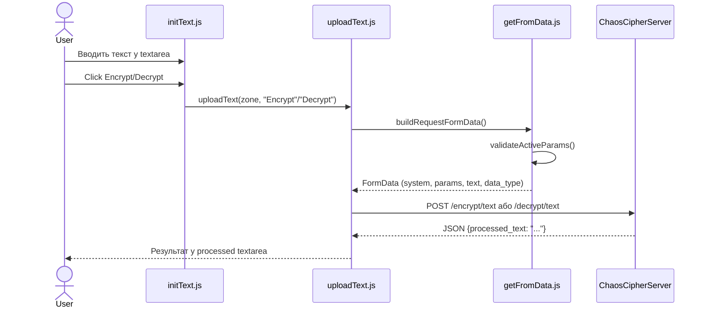
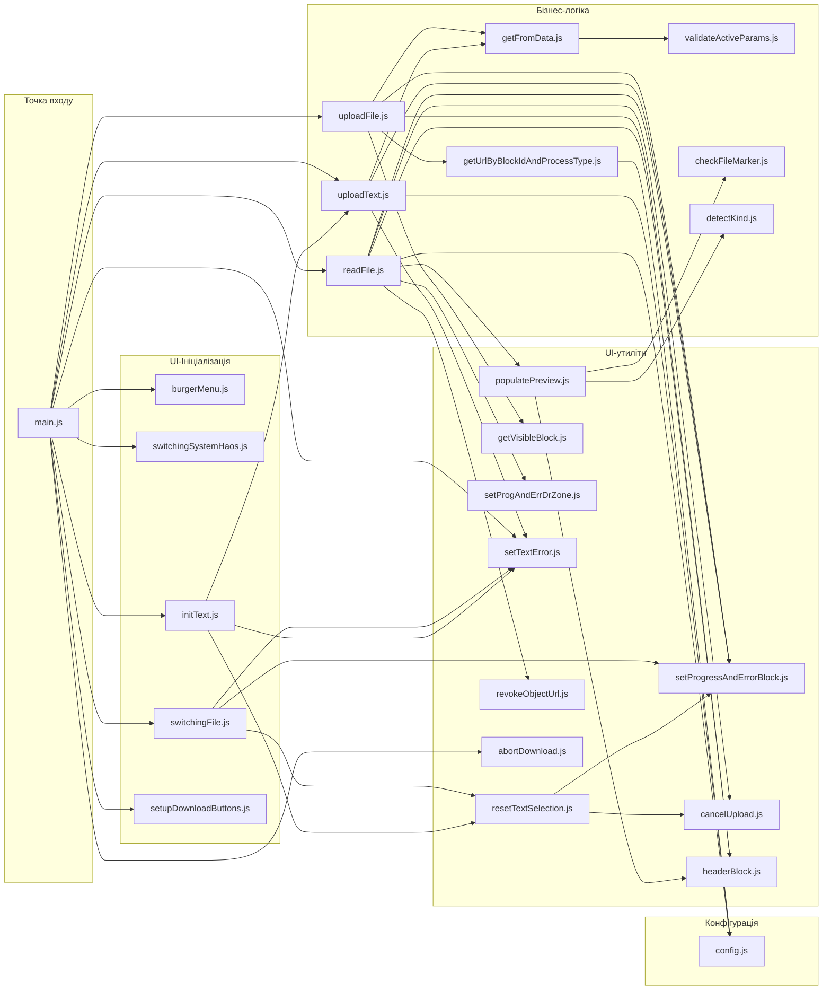

# Архітектура ChaosCipherClient

## 1. Загальний огляд

**ChaosCipherClient** — це однострінковий (SPA) веб-клієнт для шифрування та дешифрування даних на базі хаотичних систем. Побудований на чистому **HTML + CSS + Vanilla JavaScript (ES Modules)** без фреймворків та збирачів. Взаємодіє з бекендом **ChaosCipherServer** (FastAPI, Python) через REST API за допомогою `XMLHttpRequest`.

---

## 2. Файлова структура

```
ChaosCipherClient/
├── index.html                        ← Єдина HTML-сторінка (SPA)
├── styles_horizontal.css             ← Основний CSS-файл стилів
├── images/                           ← Статичні зображення (іконки, лого)
│   ├── Logo.png
│   ├── Download.png
│   ├── Dropzone.png
│   ├── File.png
│   └── Remove.png
└── js/
    ├── config.js                     ← API URL-адреси та константи
    ├── main.js                       ← Точка входу (bootstrap, event binding)
    └── features/                     ← Feature-модулі (feature-sliced)
        ├── header/                   ← Управління шапкою
        │   ├── burgerMenu.js         ← Бургер-меню (toggle)
        │   └── headerBlock.js        ← Блокування елементів header
        ├── haosSelect/               ← Вибір хаотичної системи
        │   └── switchingSystemHaos.js← Перемикання блоків параметрів
        ├── dataMode/                 ← Режим даних (Text / File)
        │   └── switchingFile.js      ← Перемикання між Text і File режимами
        ├── formData/                 ← Формування запиту до серверу
        │   ├── getFromData.js        ← Збірка FormData для запиту
        │   └── validateActiveParams.js ← Валідація параметрів хаос-системи
        ├── dropzone/                 ← Drop-зона для завантаження файлів
        │   ├── abortDownload.js      ← Скасування читання файлу
        │   ├── revokeObjectUrl.js    ← Звільнення Object URL
        │   └── setProgAndErrDrZone.js← Progress bar та помилки dropzone
        ├── file/                     ← Робота з файлами
        │   ├── readFile.js           ← Читання файлу з FileReader
        │   ├── uploadFile.js         ← Відправка файлу на сервер (XHR)
        │   ├── checkFileMarker.js    ← Перевірка маркера "CHAOSENC"
        │   └── getUrlByBlockIdAndProcessType.js ← Визначення API URL
        ├── dataBlock/                ← Управління блоками даних (UI)
        │   ├── detectKind.js         ← Визначення типу файлу (image/audio/other)
        │   ├── getVisibleBlock.js    ← Пошук активного operation-блоку
        │   ├── populatePreview.js    ← Заповнення прев'ю (image/audio/file)
        │   ├── setupDownloadButtons.js ← Логіка кнопок Download
        │   ├── setProgressAndErrorBlock.js ← Progress bar / помилки в блоках
        │   ├── resetTextSelection.js ← Скидання текстового блоку
        │   └── cancelUpload.js       ← Скасування XHR-запиту
        └── text/                     ← Робота з текстом
            ├── initText.js           ← Ініціалізація текстового режиму
            ├── uploadText.js         ← Відправка тексту на сервер
            └── setTextError.js       ← Помилки в textarea
```

---

## 3. Архітектурна діаграма

```mermaid
graph TB
    subgraph "Browser — ChaosCipherClient"
        direction TB
        
        HTML["index.html<br/>(SPA — єдина сторінка)"]
        CSS["styles_horizontal.css"]
        
        subgraph "JavaScript Modules"
            direction TB
            MAIN["main.js<br/>Точка входу"]
            CONFIG["config.js<br/>API URLs + MAX_BYTES"]
            
            subgraph "header"
                BURGER["burgerMenu.js"]
                HEADERBLK["headerBlock.js"]
            end
            
            subgraph "haosSelect"
                SYSTEM["switchingSystemHaos.js"]
            end
            
            subgraph "dataMode"
                SWITCH["switchingFile.js"]
            end
            
            subgraph "formData"
                GETFD["getFromData.js"]
                VALIDATE["validateActiveParams.js"]
            end
            
            subgraph "dropzone"
                ABORT["abortDownload.js"]
                REVOKE["revokeObjectUrl.js"]
                DZPROG["setProgAndErrDrZone.js"]
            end
            
            subgraph "file"
                READ["readFile.js"]
                UPLOAD["uploadFile.js"]
                MARKER["checkFileMarker.js"]
                URLMAP["getUrlByBlockIdAndProcessType.js"]
            end
            
            subgraph "dataBlock"
                DETECT["detectKind.js"]
                VISIBLE["getVisibleBlock.js"]
                PREVIEW["populatePreview.js"]
                DLBTNS["setupDownloadButtons.js"]
                PROGERR["setProgressAndErrorBlock.js"]
                RESETTXT["resetTextSelection.js"]
                CANCEL["cancelUpload.js"]
            end
            
            subgraph "text"
                INITTXT["initText.js"]
                UPLOADTXT["uploadText.js"]
                TXTERR["setTextError.js"]
            end
        end
    end
    
    SERVER["ChaosCipherServer<br/>FastAPI (Python)<br/>http://127.0.0.1:8000"]
    
    MAIN --> BURGER
    MAIN --> SYSTEM
    MAIN --> SWITCH
    MAIN --> READ
    MAIN --> UPLOAD
    MAIN --> UPLOADTXT
    MAIN --> DLBTNS
    MAIN --> INITTXT
    
    UPLOAD --> CONFIG
    UPLOAD --> GETFD
    UPLOAD --> VISIBLE
    UPLOAD --> URLMAP
    UPLOAD --> PROGERR
    UPLOAD --> READ
    UPLOAD --> HEADERBLK
    
    UPLOADTXT --> CONFIG
    UPLOADTXT --> GETFD
    UPLOADTXT --> PROGERR
    UPLOADTXT --> TXTERR
    
    READ --> REVOKE
    READ --> DZPROG
    READ --> HEADERBLK
    READ --> PROGERR
    READ --> PREVIEW
    READ --> CANCEL
    
    PREVIEW --> DETECT
    PREVIEW --> HEADERBLK
    PREVIEW --> MARKER
    
    GETFD --> VALIDATE
    
    URLMAP --> CONFIG
    
    SWITCH --> RESETTXT
    SWITCH --> READ
    SWITCH --> PROGERR
    SWITCH --> TXTERR
    
    INITTXT --> UPLOADTXT
    INITTXT --> TXTERR
    INITTXT --> RESETTXT
    
    RESETTXT --> PROGERR
    RESETTXT --> CANCEL
    
    UPLOAD -.->|"POST /encrypt/file<br/>POST /decrypt/file<br/>POST /encrypt/image<br/>POST /decrypt/image<br/>POST /encrypt/audio<br/>POST /decrypt/audio"| SERVER
    UPLOADTXT -.->|"POST /encrypt/text<br/>POST /decrypt/text"| SERVER
```



---

## 4. UI-структура (HTML секції)



---

## 5. Потік даних (Data Flow)

### 5.1. Шифрування/Дешифрування файлу



### 5.2. Шифрування/Дешифрування тексту



---

## 6. Конфігурація API

Визначена у [config.js](file:///c:/Users/sasha/Desktop/%D0%94%D0%B8%D0%BF%D0%BB%D0%BE%D0%BC%2025/ChaosCipher/ChaosCipherApp/ChaosCipherClient/js/config.js):

| Константа | URL |
|-----------|-----|
| `ENCRYPT_FILE_URL` | `http://127.0.0.1:8000/encrypt/file` |
| `DECRYPT_FILE_URL` | `http://127.0.0.1:8000/decrypt/file` |
| `ENCRYPT_IMAGE_URL` | `http://127.0.0.1:8000/encrypt/image` |
| `DECRYPT_IMAGE_URL` | `http://127.0.0.1:8000/decrypt/image` |
| `ENCRYPT_AUDIO_URL` | `http://127.0.0.1:8000/encrypt/audio` |
| `DECRYPT_AUDIO_URL` | `http://127.0.0.1:8000/decrypt/audio` |
| `ENCRYPT_TEXT_URL` | `http://127.0.0.1:8000/encrypt/text` |
| `DECRYPT_TEXT_URL` | `http://127.0.0.1:8000/decrypt/text` |
| `MAX_BYTES` | `1 073 741 824` (1 ГБ) |

---

## 7. Підтримувані хаотичні системи

Клієнт підтримує **6 хаотичних систем**, кожна з яких має власний блок параметрів:

| Система | ID блоку | Параметри |
|---------|----------|-----------|
| Logistic map + Lorenz | `lorenz-params` | logisticX, lorenzX, lorenzY, lorenzZ |
| Logistic map + Rössler | `rossler-params` | logisticX, rosslerX, rosslerY, rosslerZ |
| Logistic map + Chua's circuit | `chua-params` | logisticX, chuaX, chuaY, chuaZ |
| Logistic map + Duffing oscillator | `duffing-params` | logisticX, duffingX, duffingY, duffingT |
| Logistic map + V.D.Pol oscillator | `pol-params` | logisticX, polX, polY, polT |
| Logistic map + Forced pendulum | `forced-params` | logisticX, forcedX, forcedY, forcedT |

---

## 8. Типи оброблюваних даних

| Тип | Розширення | UI-блок | API endpoint |
|-----|------------|---------|--------------|
| Text | — | `#encrypt-text` | `/encrypt/text`, `/decrypt/text` |
| Image | `.png` | `#encrypt-image` | `/encrypt/image`, `/decrypt/image` |
| Audio | `.wav` | `#encrypt-audio` | `/encrypt/audio`, `/decrypt/audio` |
| Other (file) | будь-яке інше | `#encrypt-file` | `/encrypt/file`, `/decrypt/file` |

---

## 9. Ключові архітектурні рішення

### 9.1. Feature-Sliced модульна структура
Код розділений на **8 feature-модулів** (`header`, `haosSelect`, `dataMode`, `formData`, `dropzone`, `file`, `dataBlock`, `text`). Кожний модуль відповідає за конкретну функціональну область.

### 9.2. Без фреймворків та збирачів
- Чистий Vanilla JS з ES Modules (`type="module"`)
- Немає npm, webpack, Vite — файли підключаються напряму через `import`
- CSS — один файл `styles_horizontal.css`

### 9.3. DOM як стан
- Стан зберігається безпосередньо на DOM-елементах через користувацькі властивості:
  - `zone.selectedFile` — обраний файл
  - `zone.__fileBuffer` — ArrayBuffer завантаженого файлу
  - `zone.__objectUrl` — Object URL для прев'ю
  - `zone.__xhr` — активний XHR-запит
  - `zone.__reader` — активний FileReader

### 9.4. Крипто-маркер
Файл [checkFileMarker.js](file:///c:/Users/sasha/Desktop/%D0%94%D0%B8%D0%BF%D0%BB%D0%BE%D0%BC%2025/ChaosCipher/ChaosCipherApp/ChaosCipherClient/js/features/file/checkFileMarker.js) перевіряє наявність маркера `"CHAOSENC"` наприкінці файлу (останні 300 байт). Якщо маркер знайдено — файл вважається зашифрованим, кнопка Encrypt блокується, а Decrypt активується (і навпаки).

### 9.5. XHR замість Fetch
Для відправки файлів використовується `XMLHttpRequest` (а не `fetch`), що дозволяє відстежувати прогрес завантаження через `xhr.upload.onprogress`.

### 9.6. Клієнтська валідація параметрів
Модуль [validateActiveParams.js](file:///c:/Users/sasha/Desktop/%D0%94%D0%B8%D0%BF%D0%BB%D0%BE%D0%BC%2025/ChaosCipher/ChaosCipherApp/ChaosCipherClient/js/features/formData/validateActiveParams.js) виконує повну валідацію параметрів хаос-системи з декларативними правилами `blockRules` (min/max для кожного поля) перед відправкою на сервер.

---

## 10. Діаграма залежностей модулів


