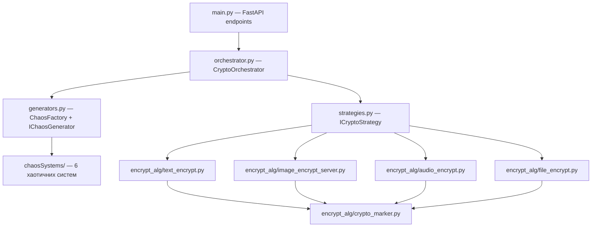

# План тестування ChaosCipherServer

## Архітектура проєкту (огляд)



---

## Рівень 1 — Хаотичні системи (`chaosSystems/`)

Файли: `lorenzSystem.py`, `rosslerSystem.py`, `chuaSystem.py`, `duffingSystem.py`, `vanDerPolSystem.py`, `forcedPendulum.py`

Кожна система має однакову структуру: `runge_kutta()` → `*_generator()` → `logistic_generator()` → `get_logistic_*_sequence()`.

### Тест-кейси

| # | Назва тесту | Що перевіряється | Очікуваний результат |
|---|------------|------------------|---------------------|
| 1.1 | **Детермінованість послідовності** | Виклик `get_logistic_*_sequence()` двічі з однаковими параметрами | Ідентичні результати |
| 1.2 | **Довжина послідовності** | `len(result)` == L для різних значень L (1, 100, 1000) | Точний збіг довжини |
| 1.3 | **SHA-256 режим (is_sha=True)** | Кожен елемент — `bytes` довжиною 1, загальна кількість == L | Коректні типи та розміри |
| 1.4 | **Float режим (is_sha=False)** | Кожен елемент — `float` | Коректний тип |
| 1.5 | **Чутливість до початкових умов** | Зміна logistic_x на 1e-15 | Послідовності різко розходяться після ~20 ітерацій |
| 1.6 | **Валідація logistic_x** | logistic_x = 0.0, 1.0, -0.5 | `ValueError("logisticX must be in (0,1)")` |
| 1.7 | **Оновлення стану** | Повернуті `new_x, new_y, new_z` != початкових | Стан оновлено |
| 1.8 | **Стабільність Runge-Kutta** | 10 000 ітерацій, перевірка `math.isfinite()` для всіх значень | Без NaN/Inf (крім Duffing, де є `OverflowError`) |
| 1.9 | **Logistic map r=3.99** | 10 000 ітерацій logistic_generator з x₀=0.3 | Всі значення в (0, 1) |

> [!TIP]
> Тести 1.1–1.4 мають бути параметризовані через `@pytest.mark.parametrize` для всіх 6 систем.

---

## Рівень 2 — Генератори (`generators.py`)

Класи: `LorenzSystemGenerator`, `RosslerSystemGenerator`, `ChuaSystemGenerator`, `DuffingSystemGenerator`, `VanDerPolSystemGenerator`, `ForcedPendulumSystemGenerator`, `ChaosFactory`

### Тест-кейси

| # | Назва тесту | Що перевіряється | Очікуваний результат |
|---|------------|------------------|---------------------|
| 2.1 | **Фабрика — валідний тип** | `ChaosFactory().create_generator("lorenz", params, "bits")` | Об'єкт `LorenzSystemGenerator` |
| 2.2 | **Фабрика — невідомий тип** | `create_generator("unknown", ...)` | `ValueError("Unknown system type")` |
| 2.3 | **Фабрика — всі 6 типів** | Створення генераторів для "lorenz", "rossler", "chua", "duffing", "pol", "forced" | Успішне створення без помилок |
| 2.4 | **Інтерфейс IChaosGenerator** | `get_sequence(100)` повертає список | `len(result) == 100` |
| 2.5 | **Збереження стану між викликами** | Два послідовні `get_sequence(10)` | Різні результати (стан змінився) |
| 2.6 | **Парсинг параметрів** | Передача params з невірними ключами | `KeyError` |
| 2.7 | **Парсинг параметрів — string float** | `params["lorenzX"] = "1.5"` (строка) | Коректне перетворення через `float()` |

---

## Рівень 3 — Алгоритми шифрування (`encrypt_alg/`)

### 3A. Текст (`text_encrypt.py`)

| # | Назва тесту | Що перевіряється | Очікуваний результат |
|---|------------|------------------|---------------------|
| 3A.1 | **Roundtrip bits-режим** | encrypt_text_bytes → decrypt_text_bytes з однаковим генератором | Відновлений текст == оригінал |
| 3A.2 | **Roundtrip chars-режим** | encrypt_text_chars → decrypt_text_chars | Відновлений текст == оригінал |
| 3A.3 | **Unicode chars-режим** | Текст: "Привіт 🌍 こんにちは" | Коректний roundtrip |
| 3A.4 | **Порожній текст** | `encrypt_text("", gen, "chars")` | Порожній результат або коректна обробка |
| 3A.5 | **Різні ключі** | Шифрування одного тексту різними генераторами | Різні шифротексти |
| 3A.6 | **Невірний ключ при дешифруванні** | Шифрування gen1, дешифрування gen2 | Текст НЕ відновлюється (RuntimeError або спотворений результат) |
| 3A.7 | **Великий текст** | 100 000 символів | Без помилок, коректний roundtrip |
| 3A.8 | **normalize_odd() — взаємна простота** | `math.gcd(normalize_odd(x, N), N) == 1` для різних x | Завжди `gcd == 1` |
| 3A.9 | **transform ↔ transform_back** | Прямі/зворотні перетворення для довільних значень | Точний roundtrip |

### 3B. Зображення (`image_encrypt_server.py`)

| # | Назва тесту | Що перевіряється | Очікуваний результат |
|---|------------|------------------|---------------------|
| 3B.1 | **Roundtrip PNG** | encrypt_image → decrypt_image (4×4 тестове зображення) | Пікселі ідентичні оригіналу |
| 3B.2 | **Різні розміри** | 1×1, 3×5, 100×200, 1024×768 | Коректний roundtrip для всіх |
| 3B.3 | **Квадратування матриці** | `square_image()` для 3×5 → side = степінь 2 | `side_size` є степенем 2, shape == (side, side, 3) |
| 3B.4 | **FSM-матриця — ранг** | `rank()` повертає перестановку [1..n²] | Всі елементи від 1 до n² присутні рівно раз |
| 3B.5 | **Scrambling ↔ Descrambling** | `scrambling()` → `scrambling_decryp()` | Повернення до вихідної матриці |
| 3B.6 | **Diffusion ↔ Diffusion_decrypt** | `diffusion()` → `diffusion_decrypt()` | Повернення до вихідної матриці |
| 3B.7 | **Header embed/extract** | `embed_header` → `extract_header` | M, N відновлені правильно |
| 3B.8 | **make_header / parse_header CRC** | Зміна одного байта заголовку | `parse_header` повертає `None` |
| 3B.9 | **log_integer_exponent** | `log_integer_exponent(16, 2)` → 4 | Коректне значення |
| 3B.10 | **Невірний файл на дешифрування** | Випадкові байти | `RuntimeError` або `ValueError` |

### 3C. Аудіо (`audio_encrypt.py`)

| # | Назва тесту | Що перевіряється | Очікуваний результат |
|---|------------|------------------|---------------------|
| 3C.1 | **Roundtrip WAV** | encrypt_auido → decrypt_auido | Аудіодані ідентичні оригіналу |
| 3C.2 | **split_wav / build_wav** | Розділення та зворотне складання | Ідентичний WAV |
| 3C.3 | **Збереження заголовку** | Після шифрування WAV-заголовок коректний | Файл відтворюється як WAV |
| 3C.4 | **xor_elements** | XOR двічі з одним ключем | Повернення до оригіналу |
| 3C.5 | **Невалідний WAV** | Файл без блоку 'data' | `ValueError("WAV: блок 'data' не найден")` |

### 3D. Файли (`file_encrypt.py`)

| # | Назва тесту | Що перевіряється | Очікуваний результат |
|---|------------|------------------|---------------------|
| 3D.1 | **Roundtrip довільний файл** | encrypt_file → decrypt_file | Байти ідентичні |
| 3D.2 | **Порожній файл** | encrypt_file(b"", gen) | Коректна обробка |
| 3D.3 | **Великий файл** | 10 МБ випадкових байтів | Без помилок |
| 3D.4 | **Без маркера при дешифруванні** | decrypt_file для файлу без CHAOSENC | `ValueError("Файл не містить маркера")` |

---

## Рівень 4 — Крипто-маркер (`crypto_marker.py`)

| # | Назва тесту | Що перевіряється | Очікуваний результат |
|---|------------|------------------|---------------------|
| 4.1 | **add_marker → remove_marker** | Roundtrip для довільних даних | `data` та `meta` відновлені |
| 4.2 | **meta-поля** | `meta["version"]`, `meta["timestamp"]`, `meta["original_filename"]` | Коректні значення |
| 4.3 | **Дані без маркера** | `remove_marker(b"random data")` | `(data, None)` |
| 4.4 | **is_marked** | Перевірка з маркером та без | `True` / `False` |
| 4.5 | **Маркер в хвості файлу** | Маркер додається в кінець, не на початок | `data[-4:]` == packed marker_size |
| 4.6 | **Довге ім'я файлу (>255 байт)** | Ім'я обрізається до 255 байт UTF-8 | Без помилок |

---

## Рівень 5 — Оркестратор (`orchestrator.py`)

| # | Назва тесту | Що перевіряється | Очікуваний результат |
|---|------------|------------------|---------------------|
| 5.1 | **Text encrypt → decrypt** | `execute_request(..., process_type="encrypt")` → `execute_request(..., process_type="decrypt")` | Текст відновлений |
| 5.2 | **Невідомий crypt_method** | `crypt_method="video"` | `ValueError("Unknown crypt_method")` |
| 5.3 | **Невідомий system_type** | `system_type="henon"` | `ValueError("Unknown system type")` |
| 5.4 | **Всі стратегії** | Перебір "text", "image", "file", "audio" | Кожна працює без помилок |
| 5.5 | **Ізоляція між запитами** | Два окремі виклики з однаковими params | Однакові результати (новий генератор кожного разу) |

---

## Рівень 6 — API-ендпоінти (`main.py`)

Використовуємо `httpx.AsyncClient` + `TestClient` з FastAPI.

| # | Назва тесту | Що перевіряється | Очікуваний результат |
|---|------------|------------------|---------------------|
| 6.1 | **POST /encrypt/text → /decrypt/text** | Roundtrip через API | `status == 200`, текст відновлений |
| 6.2 | **POST /encrypt/image** | Валідний PNG, повернення Response | `status == 200`, content-type == "image/png" |
| 6.3 | **POST /encrypt/audio** | Валідний WAV | `status == 200` |
| 6.4 | **POST /encrypt/file** | Довільний файл | `status == 200`, заголовок Content-Disposition |
| 6.5 | **Невалідний JSON params** | `params = "not json"` | `status == 500` |
| 6.6 | **Невідомий system** | `system = "unknown"` | `status == 400` або `500` |
| 6.7 | **GET /** | Головна сторінка | `status == 200`, HTML-відповідь |

---

## Додаткові категорії тестів

### Криптографічна стійкість (не unit-тести, але важливі для диплому)

| # | Назва | Опис |
|---|-------|------|
| D.1 | **NIST SP 800-22** | Перевірка послідовностей усіх 6 систем через тести NIST (Frequency, Runs, FFT та ін.) |
| D.2 | **Лавинний ефект** | Зміна 1 біта в тексті → зміна ≥40% бітів шифротексту |
| D.3 | **Гістограма пікселів** | Зашифроване зображення має рівномірний розподіл по каналах RGB |
| D.4 | **Кореляція сусідніх пікселів** | Кореляція < 0.01 для зашифрованого зображення |
| D.5 | **Інформаційна ентропія** | Ентропія зашифрованого зображення → ~7.99 (ідеал = 8.0) |
| D.6 | **Key space analysis** | Розмір простору ключів ≥ 2¹²⁸ |

---

## Рекомендований стек для тестування

```
pytest              — фреймворк тестування
pytest-asyncio      — для async ендпоінтів FastAPI
httpx               — TestClient для FastAPI
Pillow              — створення тестових зображень
soundfile + numpy   — створення тестових WAV
unittest.mock       — мокання генераторів
```

## Приклад структури файлів тестів

```
tests/
├── conftest.py                    # fixtures: генератори, тестові дані
├── test_chaos_systems.py          # Рівень 1
├── test_generators.py             # Рівень 2
├── test_text_encrypt.py           # Рівень 3A
├── test_image_encrypt.py          # Рівень 3B
├── test_audio_encrypt.py          # Рівень 3C
├── test_file_encrypt.py           # Рівень 3D
├── test_crypto_marker.py          # Рівень 4
├── test_orchestrator.py           # Рівень 5
├── test_api_endpoints.py          # Рівень 6
└── test_crypto_strength.py        # Додаткові
```

> [!IMPORTANT]
> Для roundtrip-тестів шифрування потрібно **створювати два окремих генератори** з ідентичними параметрами — один для шифрування, інший для дешифрування. Один і той самий генератор використовувати не можна, оскільки його внутрішній стан змінюється після виклику `get_sequence()`.
